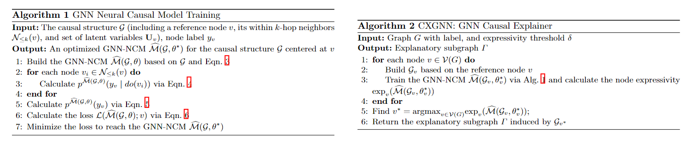
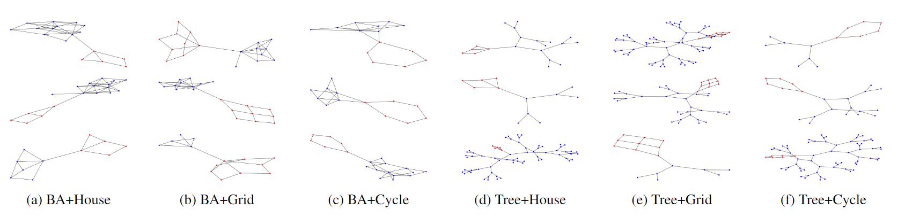
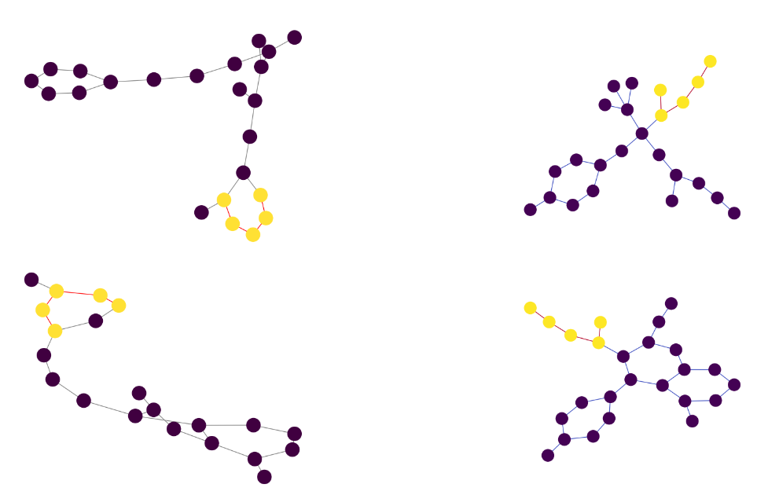

 

<!-- This repository contains the source code for the paper `Graph Neural Network Causal Explanation via Neural Causal Models` -->

# Graph Neural Network Causal Explanation
A GNN causal explainer based on a graph's causal structure and it's corresponding neural causal model. This method outperforms the existing GNN explainers in exactly finding the ground-truth explanations.

## Motivations
> Correctly graph classification via causal inference (based on interventional data)

> Understanding and quantifying cause-and-effect relations between observable variables

> Identify the causal explanatory subgraph

## Contributions
> The first GNN causal explainer

> We leverage the neural-causal connection, design the GNN neural causal models, and train them to identify the causal explanatory subgraph.

> Our results show the effectiveness of CXGNN and its superiority over the state-of-the-art association-based and causality-inspired GNN explainers

## Method 
Details of training GNN-NCMs are shown in Algorithm 1. This algorithm takes the causal structure g with respect to a reference node v as input and returns a well-trained GNN-NCM. The underlying subgraph of the causal structure is then treated as the causal explanatory subgraph Γ. Algorithm 2 describes the learning process to find Γ.

   

## Results
### Synthetic Graphs
We note that there are different ways for the ground truth subgraph to attach to the base synthetic graph. We can see CXGNN’s output exactly matches the ground truth in these cases, while the existing GNN explainers cannot. One reason could be that existing GNN explainers are sensitive to the spurious relation. 

   
<caption>Visualizing explanation results (subgraph containing the red nodes) by our CXGNN on the synthetic graphs.</caption>

### Real World Dataset
Real-world graph i.e. (Benzene: 12,000 molecular graphs, and the task is to identify whether a given molecule graph has a benzene ring or not. The ground truth explanations are the nodes(atoms)forming the benzene ring.)
 

  

We observe the explanatory subgraphs found by CXGNN approximately/exactly match the ground truth. However, no existing GNN explainers can do so.

## Related Literature

1. Agarwal, Chirag, et al. "Evaluating explainability for graph neural networks." Scientific Data 10.1 (2023): 144.
2. Luo, Dongsheng, et al. "Parameterized explainer for graph neural network." Advances in neural information processing systems 33 (2020): 19620-19631.
3. Pearl, Judea, and Dana Mackenzie. The book of why: the new science of cause and effect. Basic books, 2018.
4. Geiger, Atticus, et al. "Inducing causal structure for interpretable neural networks." International Conference on Machine Learning. PMLR, 2022.
5. Shan, Caihua, et al. "Reinforcement learning enhanced explainer for graph neural networks." Advances in Neural Information Processing Systems 34 (2021): 22523-22533.
6. Lin, Wanyu, et al. "Orphicx: A causality-inspired latent variable model for interpreting graph neural networks." Proceedings of the IEEE/CVF Conference on Computer Vision and Pattern Recognition. 2022.
